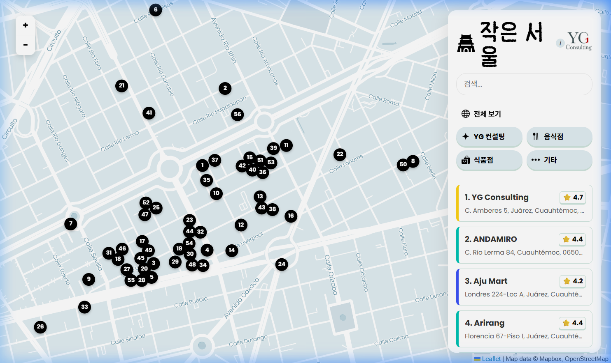
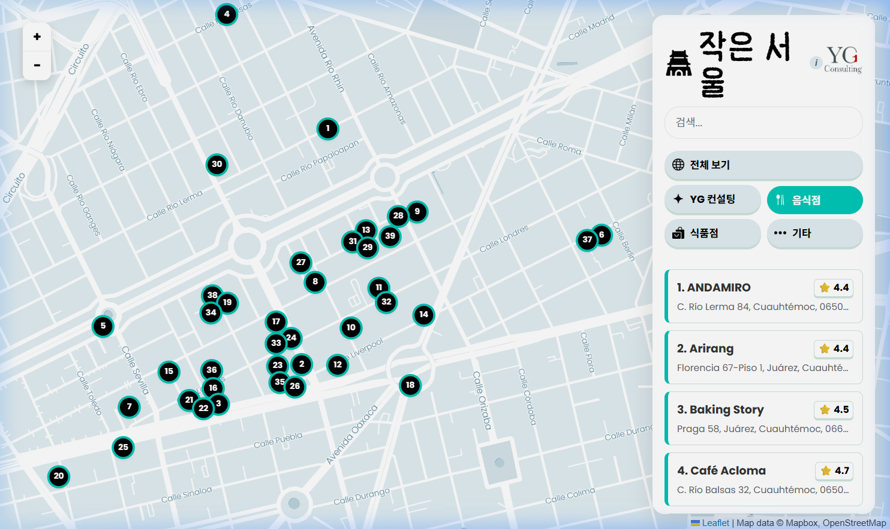
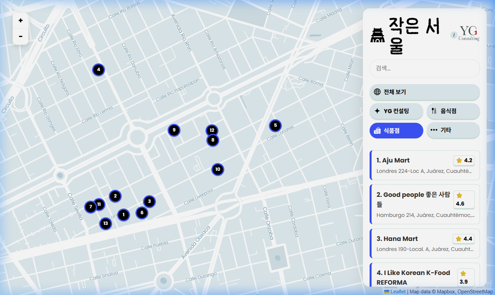
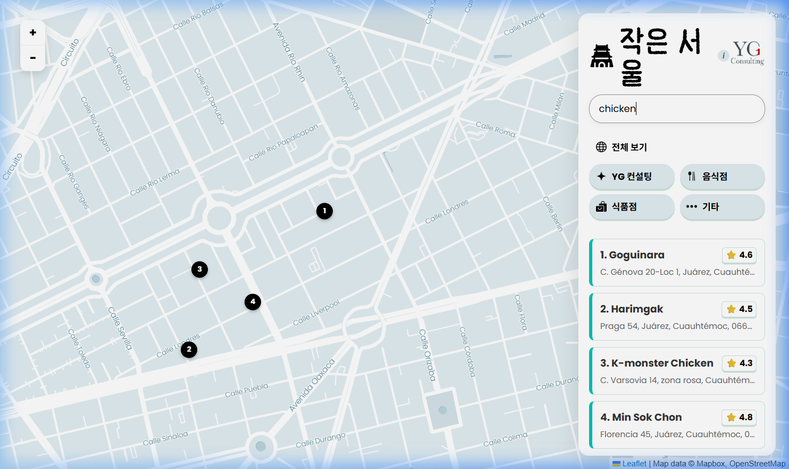
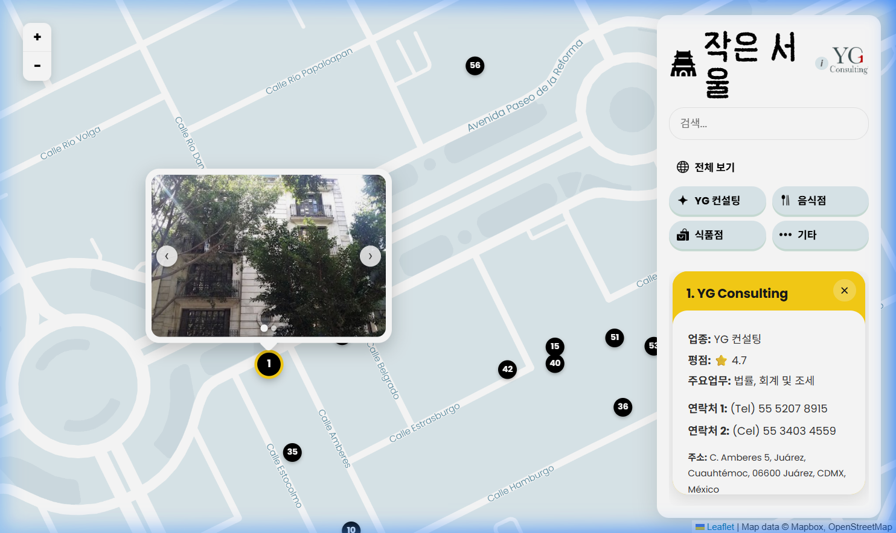

# 작은 서울 — 웹사이트 사용 설명서

인터랙티브 지도에서 제공하는 모든 기능을 간략하게 안내합니다.

---

## 1. 메인 화면 — 지도 및 업체 목록

페이지가 로드되면 왼쪽에 번호가 매겨진 마커가 있는 인터랙티브 지도와, 오른쪽에 스크롤 가능한 업체 목록 패널이 표시됩니다. 각 업체 카드에는 업체명, 주소, 구글 평점이 표시됩니다.



---

## 2. 카테고리 필터

필터 버튼을 클릭하면 특정 유형의 업체만 표시됩니다. 활성화된 필터는 강조 표시되며, 지도 마커도 카테고리별 색상 테두리와 함께 실시간으로 업데이트됩니다.

| 필터 | 설명 |
|------|------|
| 전체 보기 | 모든 업체 표시 |
| YG 컨설팅 | YG 컨설팅 서비스 |
| 음식점 | 한국 음식점 및 카페 |
| 식품점 | 한국 식품점 |
| 기타 | 기타 한인 업체 |

````carousel

<!-- slide -->

````

---

## 3. 검색창

검색 필드(`검색...`)에 업체명 또는 음식 키워드를 한국어나 영어로 입력하면 목록과 지도 마커가 즉시 필터링됩니다.

**지원되는 음식 키워드 예시:** `chicken`, `치킨`, `bbq`, `삼겹살`, `kimchi`, `김치찌개`, `jjajangmyeon`, `짜장면`, `coffee`, `커피` 등



---

## 4. 업체 상세 패널 및 사진 갤러리

목록에서 업체 카드를 클릭하거나 지도에서 마커를 클릭하면 다음 기능이 작동합니다:

- **해당 업체 위치로 확대** 이동
- **지도 위에 사진 갤러리 팝업**이 표시되며, 좌우 화살표(‹ ›)로 사진 탐색 가능
- **상세 패널**에 업종, 평점, 연락처, 주소, 구글 지도 바로가기 링크가 표시



> [!TIP]
> 상세 패널의 **✕** 버튼을 클릭하면 패널이 닫히고 전체 지도 화면으로 돌아갑니다.

---

## 5. 지도 컨트롤

| 컨트롤 | 동작 |
|--------|------|
| **+ / −** 버튼 | 확대 / 축소 |
| **마우스 스크롤** | 확대 / 축소 |
| **클릭 + 드래그** | 지도 이동 |
| **마커 클릭** | 업체 선택 및 사진 표시 |

---

## 6. 구글 지도 연결

각 업체 상세 카드에 **"구글 지도에서 보기"** 버튼이 있으며, 클릭하면 해당 업체의 위치가 새 탭에서 구글 지도로 바로 열립니다.
